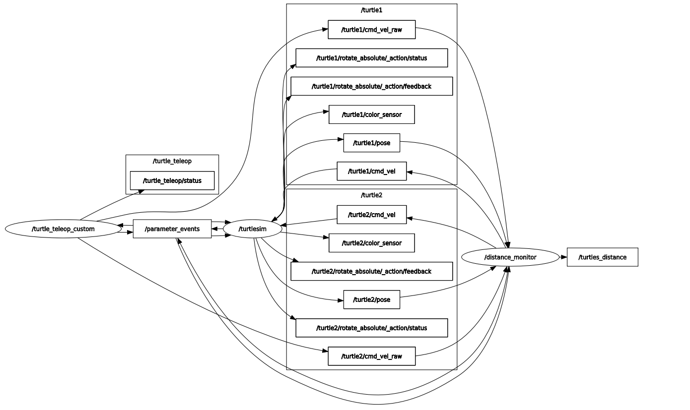

# Assignment1_RT1: Turtlesim Teleop + Safety Monotoring Node

This project implements a small ROS 2 system with two turtlesim robots:

- a UI / teleop node to control the turtles from the keyboard
- a distance / safety node that monitors them and blocks unsafe commands

Everything is written in C++ (ROS 2 Humble, ament_cmake).


## 1. How to run

### 1.1 Build the workspace

From your ROS 2 workspace root (ex `ros2_ws`):

```bash
cd ~/ros2_ws
colcon build
source install/setup.bash
```

NB: This has to be done in each new terminal opened.

### 1.2 Start turtlesim + safety node
```
ros2 launch assignment1_rt bringup.launch.py
```
### 1.3 Start the teleop UI
```
ros2 run assignment1_rt turtle_ui_node
```
## 2. Assignment requirements

- Text-based UI to:
  - choose which turtle to control (`turtle1` or `turtle2`)
  - send velocity commands for a finite `duration`
- A safety node that:
  - computes and publishes the `distance` between `turtle1` and `turtle2`
  - `stops the moving turtle` if:
    - the turtles are “too close”
    - the turtle is too close to the boundaries of the world

### Implementation

- **Teleop / UI node** (`turtle_ui_node`)
  - Keyboard control (WASD) with step-based motion:
    - `w` / `s` → forward / backward for a fixed distance  
    - `a` / `d` → rotate left / right for a fixed angle  
  - Each key press triggers a motion with a computed duration, after that:
    - a stop command is sent -> the user can send a new command.
  - Choose which turtle to control:
    - `1` → `turtle1`
    - `2` → `turtle2`
  - Speed + step tuning keys (similar to `teleop_twist_keyboard`):
    - scale linear / angular speeds
    - adjust step distance / angle
  - Publishes  raw commands to:
    - `/turtle1/cmd_vel_raw`
    - `/turtle2/cmd_vel_raw`
  - Publishes a status string on `/turtle_teleop/status` 

- **Distance / safety node** (`distance_monitor_node`)
  - Subscribes to:
    - `/turtle1/pose`, `/turtle2/pose`
    - `/turtle1/cmd_vel_raw`, `/turtle2/cmd_vel_raw`
  - Publishes:
    - `/turtles_distance` (`std_msgs/Float32`)
    - `/turtle1/cmd_vel`, `/turtle2/cmd_vel` (safe commands)
  - Parameters (set via the yaml file):
    - `distance_threshold` 
    - `min_coord`, `max_coord` (bounding box, default: `[1.0, 10.0]`)
  - Runs a safety check at 50 Hz and filters the raw commands:
    - if the turtles are too close and the command would move them closer -> it is blocked
    - if a turtle is outside the allowed box and the command would go further out -> it is blocked
    - otherwise, the command passes through


## 3. Architecture Overview

### Nodes

- `turtle_teleop_custom` (executable: `turtle_ui_node`)
- `distance_monitor` (executable: `distance_monitor_node`)
- `turtlesim_node` (from `turtlesim` package)

### Topics

**Teleop outputs (raw):**

- `/turtle1/cmd_vel_raw` (`geometry_msgs/Twist`)
- `/turtle2/cmd_vel_raw` (`geometry_msgs/Twist`)
- `/turtle_teleop/status` (`std_msgs/String`)

**Safety node:**

- Subscribes:
  - `/turtle1/pose`, `/turtle2/pose` (`turtlesim/Pose`)
  - `/turtle1/cmd_vel_raw`, `/turtle2/cmd_vel_raw` (`geometry_msgs/Twist`)
- Publishes:
  - `/turtles_distance` (`std_msgs/Float32`)
  - `/turtle1/cmd_vel`, `/turtle2/cmd_vel` (`geometry_msgs/Twist`)

The turtlesim node is configured to listen on `/turtleX/cmd_vel`, so the safety node effectively sits between teleop and turtlesim as a filter.


## 4. Safety logic

The `DistanceMonitorNode` does:

1. Compute distance between the two turtles and publish it on `/turtles_distance`.
2. For each turtle:
   - take current pose (`poseX_`)
   - take last raw command (`last_cmdX_raw_`)
   - predict where the turtle would be after a short time `dt` with that command.
3. Apply two rules:

- **Distance rule**
  - If `dist < distance_threshold` and the predicted pose would reduce the distance further,
    → the command is replaced by a zero Twist (stop).
  - If the command would move them apart or keep the same distance, it is allowed.

- **Boundary rule**
  - A bounding box is defined by `[min_coord, max_coord]` in both x and y.
  - If the turtle is already outside, we compute an “error” (distance outside the box).
  - Only commands that do not increase this error are allowed:
    - moving back inside is allowed,
    - sliding along the edge / rotating is allowed,
    - moving further out is blocked.

This keeps the turtles from colliding or disappearing off-screen, but still lets you recover if they start in a bad position.

## 5. Project/Package File Architecture & rqt_graph

```text
ROS2_WS/
├── files/
│   ├── ROS_assignment.pdf
│   └── rqt_graph.png
├── src/
│   └── assignment1_rt/
│       ├── config/
│       │   └── distance_params.yaml
│       ├── include/
│       │   └── assignment1_rt/
│       │       ├── distance_monitor_node.hpp
│       │       └── turtle_teleop_node.hpp
│       ├── launch/
│       │   └── bringup.launch.py
│       ├── src/
│       │   ├── distance_monitor_node.cpp
│       │   └── turtle_ui_node.cpp
│       ├── CMakeLists.txt
│       └── package.xml
├── .gitignore
├── README.md
```


